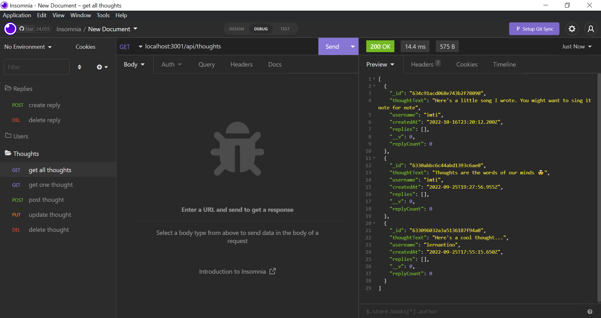

# socialite

Socialite is the backend for a social media application in which users can make posts, comment on posts and add friends.

## Primary Technologies
- Node
- Express
- Mongoose
- Insomnia

## To Use Socialite
Clone this repo and run `npm start` from the root directory. To use all the routes, you'll need to first add data to the database using Insomnia.

